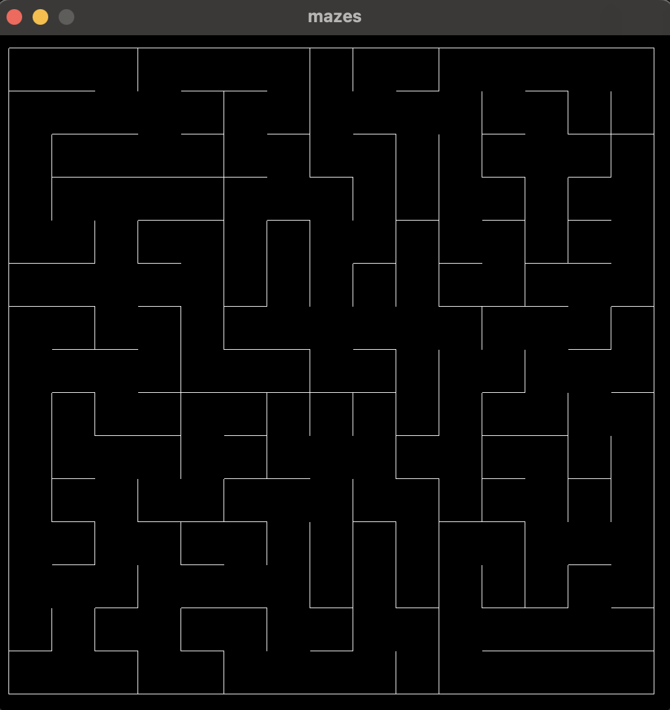

# Mazes 

Mazes is a simple repo to play with algorithms to create, display, and solve mazes. 
It is written in C, and display is done using the [raylib](https://www.raylib.com) library. 

## Startup 

Run `./build.sh`

## Usage 

Run `./mazes`

## Controls 
### Basic controls 
- w OR up arrown = move up 
- a OR left arrow = move left 
- d or right arrow = move right 
- s or down arrow = move down 

### Developer mode controls (requires recompile)
- Shift + Up arrow = incrase maze height 
- Shift + Down arrow = decrease maze height 
- Shift + Right arrow = increase maze width 
- Shift + Left arrow = decrease maze width 
- Space = reset maze 
- Shift + b = generate binary tree maze 
- b = generate binary tree maze (animate generation)
- Shift + i = generate sidewinder maze 
- i = generate sidewinder maze (animate generation)
- Shift + r = generate random walk 
- r = generate random walk (animate generation)
- c = color grid showing distance from current cell to the rest of the maze 
- Shift + c = color grid showing animation
- p = turn on / off player dot 
- g = randomly set start and end positions